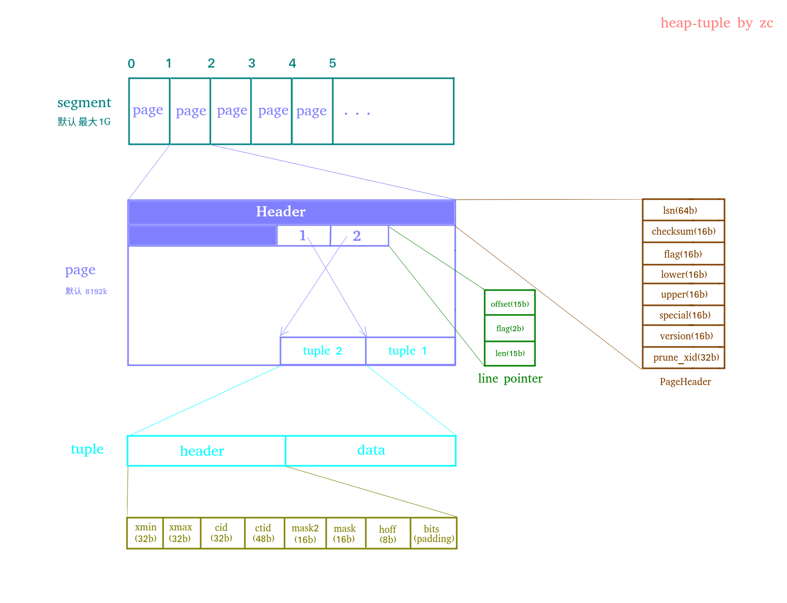

### postgres 的物理存储结构

[toc]

#### 环境准备

- ubuntu 20.04.1
- 安装数据库
  ```bash
  sudo apt install postgresql-12
  ```
- 启动 psql 客户端
  ```shell
  sudo su postgres -c psql
  ```
- 数据库初始化
  ```sql
  drop database if exists mydb;
  create database mydb;
  \c mydb
  ```

#### 结构概览
##### 1. 查看数据存储位置

  ```sql
  select * from pg_file_settings ;
  
  /*
                  sourcefile                | sourceline | seqno |            name            |                 setting                 | applied | error 
   -----------------------------------------+------------+-------+----------------------------+-----------------------------------------+---------+-------
    /etc/postgresql/12/main/postgresql.conf |         41 |     1 | data_directory             | /var/lib/postgresql/12/main             | t       | 
    /etc/postgresql/12/main/postgresql.conf |         43 |     2 | hba_file                   | /etc/postgresql/12/main/pg_hba.conf     | t       | 
    /etc/postgresql/12/main/postgresql.conf |         45 |     3 | ident_file                 | /etc/postgresql/12/main/pg_ident.conf   | t       | 
    /etc/postgresql/12/main/postgresql.conf |         49 |     4 | external_pid_file          | /var/run/postgresql/12-main.pid         | t       | 
    /etc/postgresql/12/main/postgresql.conf |         63 |     5 | port                       | 5432                                    | t       | 
    /etc/postgresql/12/main/postgresql.conf |         64 |     6 | max_connections            | 100                                     | t       | 
    /etc/postgresql/12/main/postgresql.conf |         66 |     7 | unix_socket_directories    | /var/run/postgresql                     | t       | 
    /etc/postgresql/12/main/postgresql.conf |        100 |     8 | ssl                        | on                                      | t       | 
    /etc/postgresql/12/main/postgresql.conf |        102 |     9 | ssl_cert_file              | /etc/ssl/certs/ssl-cert-snakeoil.pem    | t       | 
    /etc/postgresql/12/main/postgresql.conf |        104 |    10 | ssl_key_file               | /etc/ssl/private/ssl-cert-snakeoil.key  | t       | 
    /etc/postgresql/12/main/postgresql.conf |        121 |    11 | shared_buffers             | 128MB                                   | t       | 
    /etc/postgresql/12/main/postgresql.conf |        140 |    12 | dynamic_shared_memory_type | posix                                   | t       | 
    /etc/postgresql/12/main/postgresql.conf |        224 |    13 | max_wal_size               | 1GB                                     | t       | 
    /etc/postgresql/12/main/postgresql.conf |        225 |    14 | min_wal_size               | 80MB                                    | t       | 
    /etc/postgresql/12/main/postgresql.conf |        512 |    15 | log_line_prefix            | %m [%p] %q%u@%d                         | t       | 
    /etc/postgresql/12/main/postgresql.conf |        539 |    16 | log_timezone               | Asia/Shanghai                           | t       | 
    /etc/postgresql/12/main/postgresql.conf |        545 |    17 | cluster_name               | 12/main                                 | t       | 
    /etc/postgresql/12/main/postgresql.conf |        561 |    18 | stats_temp_directory       | /var/run/postgresql/12-main.pg_stat_tmp | t       | 
    /etc/postgresql/12/main/postgresql.conf |        649 |    19 | datestyle                  | iso, ymd                                | t       | 
    /etc/postgresql/12/main/postgresql.conf |        651 |    20 | timezone                   | Asia/Shanghai                           | t       | 
    /etc/postgresql/12/main/postgresql.conf |        665 |    21 | lc_messages                | en_US.UTF-8                             | t       | 
    /etc/postgresql/12/main/postgresql.conf |        667 |    22 | lc_monetary                | zh_CN.UTF-8                             | t       | 
    /etc/postgresql/12/main/postgresql.conf |        668 |    23 | lc_numeric                 | zh_CN.UTF-8                             | t       | 
    /etc/postgresql/12/main/postgresql.conf |        669 |    24 | lc_time                    | zh_CN.UTF-8                             | t       | 
    /etc/postgresql/12/main/postgresql.conf |        672 |    25 | default_text_search_config | pg_catalog.english                      | t       | 
    (25 rows)
  
  */
  ```
##### 2. 查看目录
- 所有文件
```bash
sudo su postgres
cd /var/lib/postgresql/12/main
ls -l 

# total 84
# drwx------ 6 postgres postgres 4096 5月   3 18:48 basebase
# drwx------ 2 postgres postgres 4096 5月   3 18:48 global
# drwx------ 2 postgres postgres 4096 12月 30 22:43 pg_commit_ts
# drwx------ 2 postgres postgres 4096 12月 30 22:43 pg_dynshmem
# drwx------ 4 postgres postgres 4096 5月   3 18:53 pg_logical
# drwx------ 4 postgres postgres 4096 12月 30 22:43 pg_multixact
# drwx------ 2 postgres postgres 4096 5月   3 18:36 pg_notify
# drwx------ 2 postgres postgres 4096 12月 30 22:43 pg_replslot
# drwx------ 2 postgres postgres 4096 12月 30 22:43 pg_serial
# drwx------ 2 postgres postgres 4096 12月 30 22:43 pg_snapshots
# drwx------ 2 postgres postgres 4096 5月   3 18:36 pg_stat
# drwx------ 2 postgres postgres 4096 12月 30 22:43 pg_stat_tmp
# drwx------ 2 postgres postgres 4096 12月 30 22:43 pg_subtrans
# drwx------ 2 postgres postgres 4096 12月 30 22:43 pg_tblspcbase
# drwx------ 2 postgres postgres 4096 12月 30 22:43 pg_twophase
# -rw------- 1 postgres postgres    3 12月 30 22:43 PG_VERSION 
# drwx------ 3 postgres postgres 4096 4月   7 00:13 pg_wal
# drwx------ 2 postgres postgres 4096 12月 30 22:43 pg_xact
# -rw------- 1 postgres postgres   88 12月 30 22:43 postgresql.auto.conf
# -rw------- 1 postgres postgres  130 5月   3 18:36 postmaster.opts
# -rw------- 1 postgres postgres  107 5月   3 18:36 postmaster.pid

```
- 普通文件
```bash
ls -l|grep ^-
#
# -rw------- 1 postgres postgres    3 12月 30 22:43 PG_VERSION              主版本号
# -rw------- 1 postgres postgres   88 12月 30 22:43 postgresql.auto.conf    保存使用 ALTER SYSTEM 命令创建的配置的配置文件，不要手动修改！
# -rw------- 1 postgres postgres  130 5月   3 18:36 postmaster.opts         最近一次数据库启动时的命令 cat postmaster.opts && ps aux|grep postgres
# -rw------- 1 postgres postgres  107 5月   3 18:36 postmaster.pid          锁文件，记录了pid, 数据目录，数据库启动时的时间辍，监听端口，unix domain socket 的路径， 监听地址， 共享内存段ID

cat PG_VERSION
# 12

cat postgresql.auto.conf 
# # Do not edit this file manually!
# # It will be overwritten by the ALTER SYSTEM command.
psql -c 'ALTER SYSTEM SET wal_level = replica;'
cat postgresql.auto.conf 
# # Do not edit this file manually!
# # It will be overwritten by the ALTER SYSTEM command.
# wal_level = 'replica'
psql -c 'ALTER SYSTEM RESET wal_level;'
cat postgresql.auto.conf 
# # Do not edit this file manually!
# # It will be overwritten by the ALTER SYSTEM command.

cat postmaster.opts && ps aux|grep postgres
# /usr/lib/postgresql/12/bin/postgres "-D" "/var/lib/postgresql/12/main" "-c" "config_file=/etc/postgresql/12/main/postgresql.conf"
# postgres     863  0.0  0.0 221356 29200 ?        Ss   18:36   0:00 /usr/lib/postgresql/12/bin/postgres -D /var/lib/postgresql/12/main -c config_file=/etc/postgresql/# 12/main/postgresql.conf
# postgres     885  0.0  0.0 221460  6240 ?        Ss   18:36   0:00 postgres: 12/main: checkpointer   
# postgres     886  0.0  0.0 221356  5872 ?        Ss   18:36   0:00 postgres: 12/main: background writer   
# postgres     887  0.0  0.0 221356  9900 ?        Ss   18:36   0:00 postgres: 12/main: walwriter   
# postgres     888  0.0  0.0 222032  8320 ?        Ss   18:36   0:00 postgres: 12/main: autovacuum launcher   
# postgres     889  0.0  0.0  75856  4868 ?        Ss   18:36   0:00 postgres: 12/main: stats collector   
# postgres     890  0.0  0.0 221896  6620 ?        Ss   18:36   0:00 postgres: 12/main: logical replication launcher   
# root        4532  0.0  0.0  15276  5188 pts/1    S+   19:09   0:00 sudo su postgres -c psql
# root        4533  0.0  0.0  14224  4736 pts/1    S+   19:09   0:00 su postgres -c psql
# postgres    4534  0.0  0.0  30704 10688 ?        Ss   19:09   0:00 /usr/lib/postgresql/12/bin/psql
# postgres    4542  0.0  0.0 222528 13592 ?        Ss   19:09   0:00 postgres: 12/main: postgres postgres [local] idle
# root        5054  0.0  0.0  15276  5232 pts/2    S    19:21   0:00 sudo su postgres
# root        5057  0.0  0.0  14224  4736 pts/2    S    19:21   0:00 su postgres
# postgres    5058  0.0  0.0  13136  4420 pts/2    S    19:21   0:00 bash
# postgres    6775  0.0  0.0  14792  3724 pts/2    R+   20:19   0:00 ps aux
# postgres    6776  0.0  0.0  12112   724 pts/2    R+   20:19   0:00 grep postgres
# 

cat postmaster.pid 
# 863
# /var/lib/postgresql/12/main
# 1620038205
# 5432
# /var/run/postgresql
# localhost
#   5432001         0
# ready  

```

- 文件夹
```bash
ls -l|grep ^d
# drwx------ 6 postgres postgres 4096 5月   3 18:48 base            存放所有数据库
# drwx------ 2 postgres postgres 4096 5月   3 18:48 global          存放全局的表
# drwx------ 2 postgres postgres 4096 12月 30 22:43 pg_commit_ts    事务提交的时间戳
# drwx------ 2 postgres postgres 4096 12月 30 22:43 pg_dynshmem     
# drwx------ 4 postgres postgres 4096 5月   3 18:53 pg_logical
# drwx------ 4 postgres postgres 4096 12月 30 22:43 pg_multixact
# drwx------ 2 postgres postgres 4096 5月   3 18:36 pg_notify
# drwx------ 2 postgres postgres 4096 12月 30 22:43 pg_replslot     逻辑复制槽信息
# drwx------ 2 postgres postgres 4096 12月 30 22:43 pg_serial
# drwx------ 2 postgres postgres 4096 12月 30 22:43 pg_snapshots
# drwx------ 2 postgres postgres 4096 5月   3 18:36 pg_stat
# drwx------ 2 postgres postgres 4096 12月 30 22:43 pg_stat_tmp
# drwx------ 2 postgres postgres 4096 12月 30 22:43 pg_subtrans
# drwx------ 2 postgres postgres 4096 12月 30 22:43 pg_tblspc       表空间的链接
# drwx------ 2 postgres postgres 4096 12月 30 22:43 pg_twophase
# drwx------ 3 postgres postgres 4096 4月   7 00:13 pg_wal          wal 日志
# drwx------ 2 postgres postgres 4096 12月 30 22:43 pg_xact         事务信息

ls -l base
# total 40
# drwx------ 2 postgres postgres 12288 5月   3 18:36 1
# drwx------ 2 postgres postgres  4096 12月 30 22:43 13464
# drwx------ 2 postgres postgres 12288 5月   3 18:48 13465
# drwx------ 2 postgres postgres 12288 5月   3 18:48 16528
psql -c'select * from pg_database ;'

```

#### 表

##### 0. 准备

```sql
-- 1. 建表
drop table if exists tb1;
create table tb1
(
    id   int primary key,
    data int
);
-- 2. 插入 10 条数据
insert into tb1
select generate_series(1, 10), generate_series(1, 10);
-- 3. 手动触发数据的抽样统计， 用于计划器生成更准确的执行计划
analyze;
-- 4. 触发脏页刷盘
# vacuum full;
checkpoint;
-- 4. 查看建好的表
\d+ tb1
```


##### 1. 怎么找到它在哪儿？

```sql
select pg_relation_filepath('tb1');
/*
 pg_relation_filepath 
----------------------
 base/476872/476873
(1 row)

解释：
1. 路径是相对 data_directory 的 (select * from pg_file_settings where name = 'data_directory';)
2. 476872 这个数字是database的 oid (select oid, * from pg_database where oid = '476872';)
3. 476873 这个数字是表文件节点的id 即 relfilenode (select * from pg_class where relname = 'tb1';)

*/
```

##### 2. 它是怎么存储数据的？



##### 3. 如何在磁盘上查看这些数据？

```shell
# 查看文件信息
ls -l PGDATA/base/117450/442760
# 截取一个 page
head -c 8192 PGDATA/base/117450/442760 > one.page
# 查看二进制文件
hexdump -C one.page

# 输出格式
# 00000000  15 00 00 00 e0 f2 51 f7  00 00 00 00 40 00 c0 1e  |......Q.....@...|
# 00000010  00 20 04 20 00 00 00 00  e0 9f 40 00 c0 9f 40 00  |. . ......@...@.|
# 00000020  a0 9f 40 00 80 9f 40 00  60 9f 40 00 40 9f 40 00  |..@...@.`.@.@.@.|
# 00000030  20 9f 40 00 00 9f 40 00  e0 9e 40 00 c0 9e 40 00  | .@...@...@...@.|
# 00000040  00 00 00 00 00 00 00 00  00 00 00 00 00 00 00 00  |................|
# *
# 00001ec0  ef 7d 86 00 00 00 00 00  00 00 00 00 00 00 00 00  |.}..............|
# 00001ed0  0a 00 02 00 00 09 18 00  0a 00 00 00 0a 00 00 00  |................|
# 00001ee0  ef 7d 86 00 00 00 00 00  00 00 00 00 00 00 00 00  |.}..............|
# 00001ef0  09 00 02 00 00 09 18 00  09 00 00 00 09 00 00 00  |................|
# 00001f00  ef 7d 86 00 00 00 00 00  00 00 00 00 00 00 00 00  |.}..............|
# 00001f10  08 00 02 00 00 09 18 00  08 00 00 00 08 00 00 00  |................|
# 00001f20  ef 7d 86 00 00 00 00 00  00 00 00 00 00 00 00 00  |.}..............|
# 00001f30  07 00 02 00 00 09 18 00  07 00 00 00 07 00 00 00  |................|
# 00001f40  ef 7d 86 00 00 00 00 00  00 00 00 00 00 00 00 00  |.}..............|
# 00001f50  06 00 02 00 00 09 18 00  06 00 00 00 06 00 00 00  |................|
# 00001f60  ef 7d 86 00 00 00 00 00  00 00 00 00 00 00 00 00  |.}..............|
# 00001f70  05 00 02 00 00 09 18 00  05 00 00 00 05 00 00 00  |................|
# 00001f80  ef 7d 86 00 00 00 00 00  00 00 00 00 00 00 00 00  |.}..............|
# 00001f90  04 00 02 00 00 09 18 00  04 00 00 00 04 00 00 00  |................|
# 00001fa0  ef 7d 86 00 00 00 00 00  00 00 00 00 00 00 00 00  |.}..............|
# 00001fb0  03 00 02 00 00 09 18 00  03 00 00 00 03 00 00 00  |................|
# 00001fc0  ef 7d 86 00 00 00 00 00  00 00 00 00 00 00 00 00  |.}..............|
# 00001fd0  02 00 02 00 00 09 18 00  02 00 00 00 02 00 00 00  |................|
# 00001fe0  ef 7d 86 00 00 00 00 00  00 00 00 00 00 00 00 00  |.}..............|
# 00001ff0  01 00 02 00 00 09 18 00  01 00 00 00 01 00 00 00  |................|
# 00002000

```


##### 4. 有更方便的查看方式吗？

```sql
create extension pageinspect;
select * from heap_page_items(get_raw_page('tb1', 0)) limit 5;
/*
 lp | lp_off | lp_flags | lp_len |  t_xmin  | t_xmax | t_field3 | t_ctid | t_infomask2 | t_infomask | t_hoff | t_bits | t_oid |       t_data       
----+--------+----------+--------+----------+--------+----------+--------+-------------+------------+--------+--------+-------+--------------------
  1 |   8160 |        1 |     32 | 29001803 |      0 |        0 | (0,1)  |           2 |       2304 |     24 |        |       | \x0100000001000000
  2 |   8128 |        1 |     32 | 29001966 |      0 |        0 | (0,2)  |           2 |       2304 |     24 |        |       | \x0200000002000000
  3 |   8096 |        1 |     32 | 29001966 |      0 |        0 | (0,3)  |           2 |       2304 |     24 |        |       | \x0300000003000000
  4 |   8064 |        1 |     32 | 29001966 |      0 |        0 | (0,4)  |           2 |       2304 |     24 |        |       | \x0400000004000000
  5 |   8032 |        1 |     32 | 29001966 |      0 |        0 | (0,5)  |           2 |       2304 |     24 |        |       | \x0500000005000000

*/
```

#### FSM（Free Space Map）

```sql
create extension pg_freespacemap;
select * from pg_freespance('tb1');
```


#### VM

```
 pg_visibility
```


#### b+ tree 索引


#### MVCC

```
```


